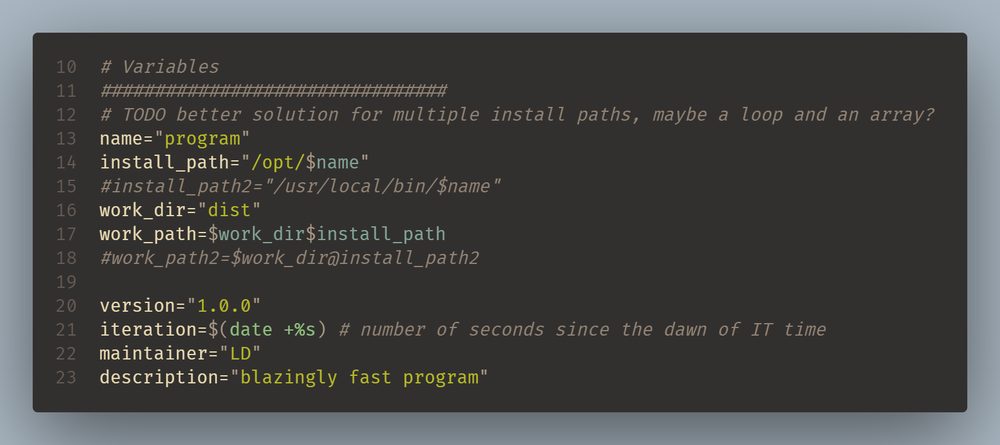
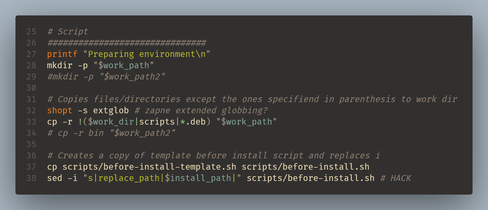
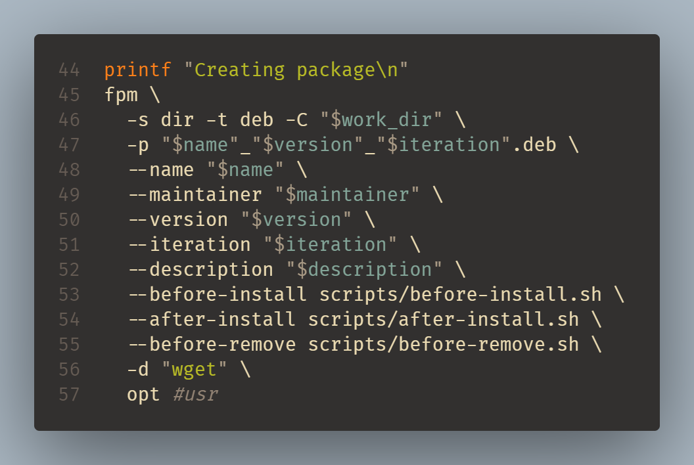

# Gitlab CI/CD configuration template
Read about it:

[FPM - Read The Docs](https://fpm.readthedocs.io/en/latest/)

[Gitlab CI/CD](https://docs.gitlab.com/ee/ci/)

## How to set up
### Prequesities
- Gitlab Runner - [how to set up](https://docs.gitlab.com/runner/install/)
- a pair of SSH keys
- Debian based target server

### Steps
1. Create following Gitlab repo variables:
    - **DEPLOY_SSH_KEY** → private SSH key
    - **DEPLOY_SSH_ID** → known_hosts entry for your server; `<ip> <pubkey>`
    - **DEPLOY_HOST** → target server IP
2. Copy and run `prep.sh` on your target CI/CD server. Paste in your public SSH key when prompted, or leave empty and copy it manually.
3. Put contents of *project* directory into the root folder of your repo.
4. Configure variables and package installation paths in the *Variables* section of `makedeb.sh`.
Should your package have several install paths, write commands to create these paths and copy files to them. If the pre/post install/upgrade scripts will refer to these paths, make sure to modify them accordingly.

5. Modify the fpm command, mainly the dependencies (`-d`) and which folders to install to (`opt`).

6. Modify or add package state change scripts (`before-install, after-install, before-remove...`)
7. Commit and push changes, which should automatically start a CI/CD pipeline.